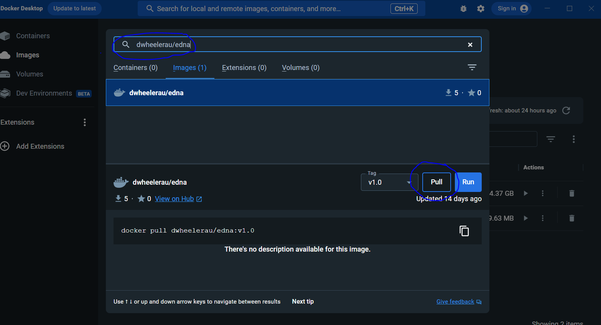
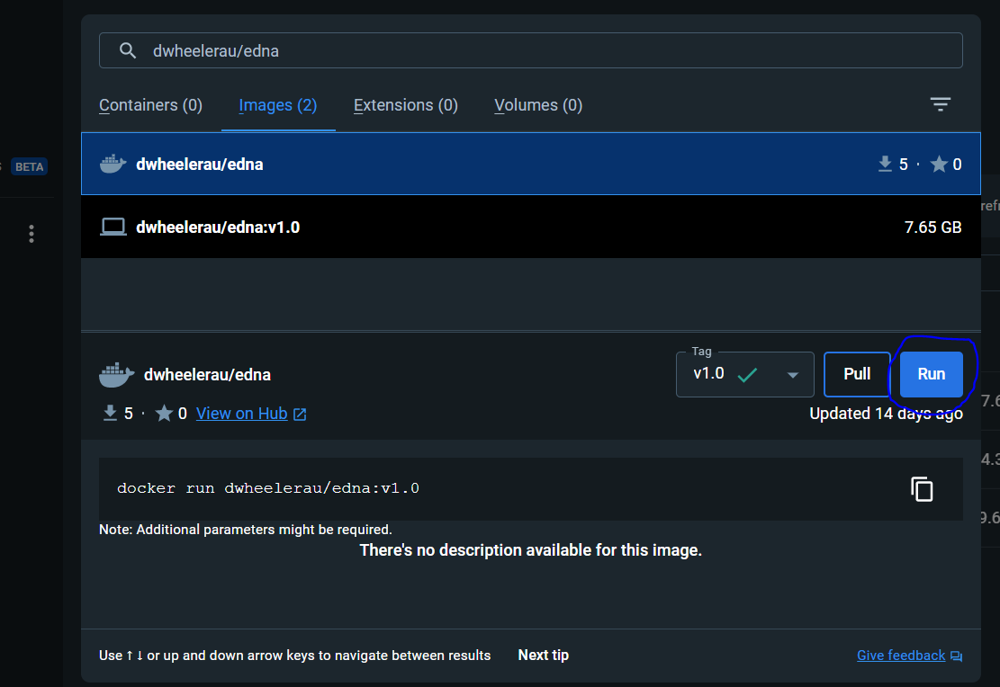
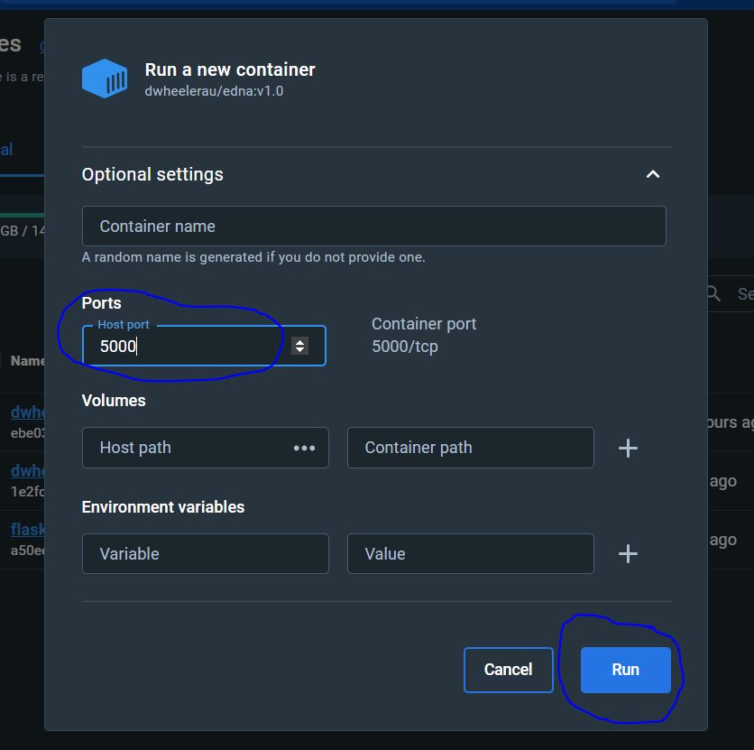
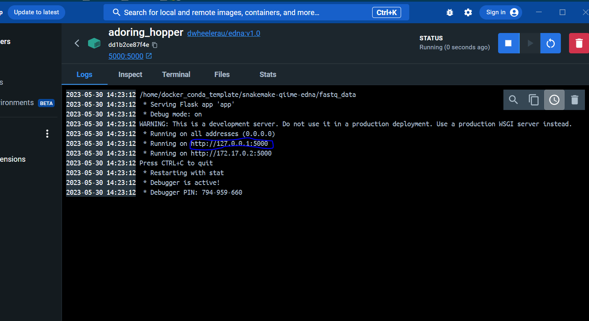
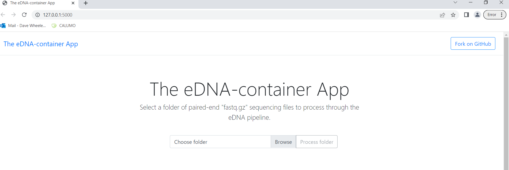
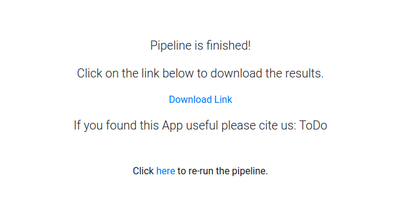
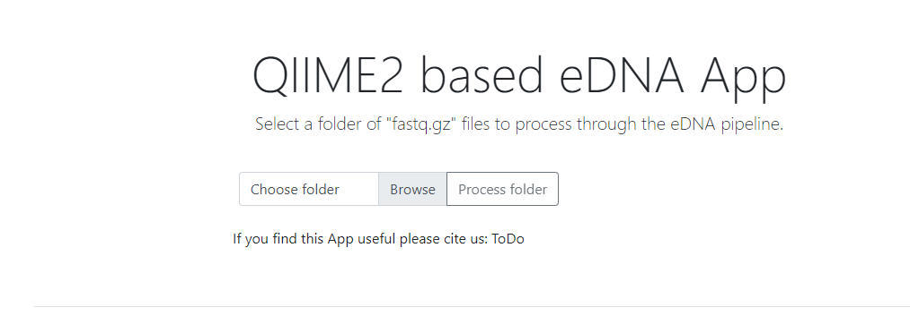
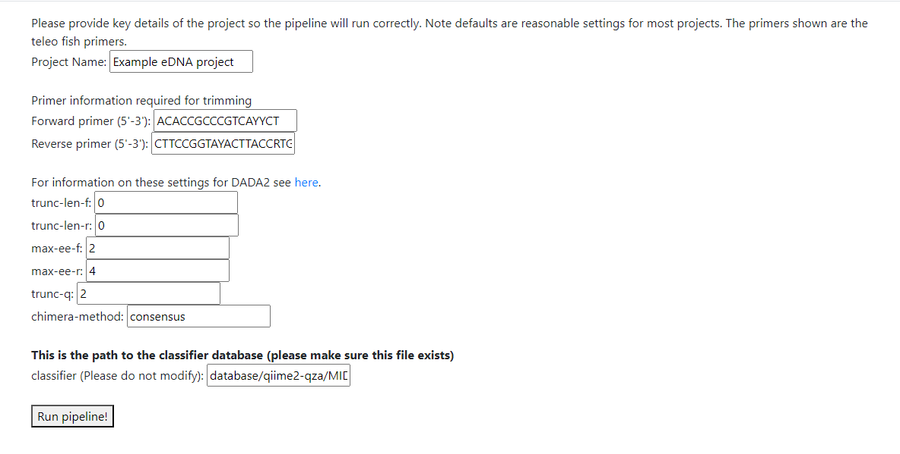
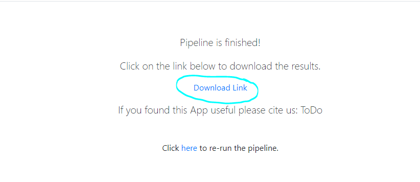

# The eDNA-container app

## Introduction
A Docker image containing a eDNA pipeline based on
[QIIME2](https://qiime2.org/). The pipeline is controlled via flask GUI that runs
in the users browser.   

**The advantages of the pipeline are:**  
- simple to setup and run using point and click with a browser based GUI
- should run on any machine where [Docker-desktop](https://www.docker.com/products/docker-desktop/) can be installed
- adaptable to any primer combination or taxonomic database
- snakemake is used to confirm successful completion of each stage of the pipeline
- species summary tables with counts are created, including the ASV sequence for manual confirmation of the taxonomic classification
- rarefaction and taxonomic barplots are generated that can be viewed using the [QIIME viewer](https://view.qiime2.org/) (drag and drop)
- A PDF report is generated containing QC plots and important information about the ASV generation so that QC parameters can be optimised 

The pipeline can also be used without Docker as described at this [repo](https://bitbucket.org/dpi_data_analytics/snakemake-qiime-edna/src/master/).  

## Running the image in a container on Windows
Ensure that the Docker-desktop app is installed on your windows computer. The
offical guide for installing Docker-desktop can be found [here](https://docs.docker.com/desktop/install/windows-install/).
If you run into any issues a more complete guide is available
[here](https://github.com/dwheelerau/docker-guide).  

1. Start by opening the Docker-desktop app.  
2. In the search bar at the top of the page search for `dwheelerau/edna`, then use the "Pull"
button to obtain a copy of the pipeline image. Downloading the image (~7GB) will take some time depending 
on your internet connnection. 


3. After the image has downloaded click the "Run" button.  


4. Use the "Optional settings" drop down to open host port 5000 as shown in the image
below, then click "Run".  


5. The log section of the container should look like the image below, this is showning the IP
address for The eDNA-container app user interface, click on the top link or type `http://127.0.0.1:5000`
in an internet browser (**Note:** No data is transfered over the internet, the pipeline will
run using the local computer resources).


6. Please wait a few seconds while the pipeline setup beings, if this has been successful the
following screen should display.


Follow the instructions below to carry out an eDNA analysis using the pipeline. **Note** for
future runs on the pipeline all that is required is to click the "Play" Button next to the 
container ID in the Docker-desktop app. Remember to shutdown the container using the "Stop"
button to free up system resources after you have completed the analysis.

## Analysing paired-end sequencing data using The eDNA-container app  
The pipeline is currently only configured to process paired-end fastq.gz sequencing files.
Ensure that the target directory only contains sequencing data for the samples you wish
to analyse.

We have included test data in the test_data folder if you wish to try out the pipeline (just
use the default settings).

1. Using the browser based user interface select the target folder of `fastq.gz` files that you wish 
to process through the pipeline and click the "Upload" button (note no data is transfered
over the internet).  


2. Click the "Process folder" button to open the settings page.  


3. The next page is the settings page, the following table details each option. **Note** 
be sure to set `trunc-len-f` and `trunc-len-r` to 0 when using variable length amplicons
in order to avoid introducting trimming biases. We recommend running the pipeline initially
with the default quality settings and then adjusting these based on the outputs
pressented in the `final-report.pdf` (specifically the raw read QC plots and DADA2 tables).

| Setting  | Explanation  |
|---|---|
| Project name  | A name for your project (will be used as the project title) |
| Forward primer  | Forward PCR primer sequence for cutadapt primer/adapter removal |
| Reverse primer  | Reverse PCR primer sequence for cutadapt primer/adapter removal |
| trunc-len-f  | Remove 3' end of forward read at this position due to low quality (0=no trim)  |
| trunc-len-r  | Remove 3' end of reverse read at this position due to low quality (0=no trim) |
| max-ee-f  | Forward reads with > number expected errors will be discarded  |
| max-ee-r  | Reverse reads with > number expected errors will be discarded  |
| trunc-q  | Truncate reads at first instance of quality score <= value |
| chimera-method  | chimera removal method: consensus, pooled, or none  |
| Taxonomic database  | File location for a QIIME2 compatible (.qza) naive_bayes clasifier (optional)  |

Table describing the key settings; for additional information see the 
[DADA2](https://docs.qiime2.org/2023.2/plugins/available/dada2/denoise-paired/)
and [naive_bayes classifier](https://docs.qiime2.org/2022.2/plugins/available/feature-classifier/fit-classifier-naive-bayes/) 
pages. A classifier based on the MIDORI2 database (12S rRNA) and the Telo fish primer amplicon
is provided as a default (F:5'ACACCGCCCGTCAYYCT3'/R:5'CTTCCGGTAYACTTACCRTG3'). 

4. When you are ready click the "Run pipeline!" command to start the analysis. A data submitted screen (below)
will be replaced by a Download data link once the pipeline has completed. As noted before this analysis
is performed on your own computer inside your local Docker environment with the download link a shortcut
to data stored inside the eDNA-container app.


A summary of the key outputs are below. If your analysis fails you will be notified by a message
on the user interface, if this occurs see the FAQ. Any file ending in .qzv can be viewed by drag 
and drop into the [QIIME2 viewer](https://view.qiime2.org/). You can also test the pipeline using
the defaults with the example data in the testing_data folder.

## Key outputs
| file path  | Explanation  |
|---|---|
| final_results/final-report.pdf  | A PDF report describing some key outputs from your run |
| final_results/asv_count_tax_seqs_summary.csv  | Final spreadsheet of eDNA taxa counts  |
| final_results/barchart.qzv  | species barplot  |
| final_results/alpha_rarefaction.qzv  | Alpha diversity rarefaction plot viewable using the qiime2 viewer  |
| paired-end-demux.qzv  | Read quality plots viewable using the qiime2 viewer  |
|  final_results/asvs | Amplified Sequence Variant files |
| logs  | DADA2 and cutadapt plugin log files  |
| Report_data/boxplot-forward.png  | Boxplot of forward read used in report  |
| Report_data/boxplot-reverse.png  | Boxplot of reverse read used in report |
| manifest/manifest.tsv  | Sample metadata used to assign sequence files to samples  |

## Running the pipeline using terminal commands (Windows/Linux)  
If you are confortable using the command line and Docker is installed
the following can be used to run the pipeline without the user interface.  
```
docker pull dwheelerau/edna
```
Downloading the image (~7GB) will take some time depending on your internet connnection.

4. The image should appear in your Docker desktop app under the 'images' section (see screen shot below). 
Click the copy icon next to the iamge id code as shown below (this code will be used in the next command). 

.

5. Type the following command in the terminal window replacing "IMAGEID"
with the code you copied above (you can "paste" by right clicking on the command prompt window boarder
and selecting edit->paste).
```
docker run -p 80:5000 --rm IMAGEID
```


6. Open a internet browser (we recommend chrome or firebox) and enter the following IP address  
```
http://127.0.0.1:80
```
The following window should open (after a short wait for the app to start). Any errors during 
the run should appear in the command prompt window.


7. Using the 'select' or 'browse' button select the folder where the fastq.gz sequencing files for this project are located and accept the image upload dialogue.


8. Click 'process folder' button and update the settings on the next page as required (the default if the telo fish eDNA primers)


9. When you are ready use the 'Run pipeline!' button to run the application on your data (the progress will be logged to the command prompt terminal window).


10. A running screen will be replaced by a download link to the results (zipped folder). Any errors will be reported in the command prompt window.
 

If you wish to re-use the pipeline in the future, simply open the Docker-desktop app and follow the instructions from Step 5.

## Running the image in a container on Linux
1. Make sure you have Docker installed on your OS
2. Pull the image from a terminal window
```
docker pull dwheelerau/edna:edna
```
3. Find out the image ID using
```
docker images
```
4. Run the image replacing IMAGEID with the number in the first column from the above command.
```
docker run -p 80:5000 --rm IMAGEID
```
5. Open a firefox/chrome browser window and naviate to the following IP address  (or localhost on port 80):
```
http://127.0.0.1:80
```
The app should open in the browser after a short delay. Any errors during pipeline running 
should appear in the terminal window.

6. Follow the instructions from step 7 in the windows section above.

## Building the latest version of the pipeline
Quick start after cloning this repository:
```
cd edna-contained
sudo docker build -f Dockerfile . -t dwheelerau/edna:edna
```
Once the image is stored on your computer the `docker run` command can be used to run the app.

## FAQ
Key outputs are not included in the ZIP file?
The most likely explanation is that the analysis has failed. Error message will be printed to
the Docker terminal window (logs tab), check here for any messages. The success or otherwise of 
each rule in the pipeline should highlight what went wrong. The most common errors are:
- Overly stringent trimming removing the region of overlap between the forward and reverse read
- Overly stringent quality trimming removing the region of overlap between the forward and reverse read
- providing a taxonomic sequence database that does not overlap your amplicon

The files that would be most useful to diagnose these issues are listed below, these can be
viewed with the [QIIME2 viewer](https://view.qiime2.org/) via drag and drop:
- XXXX
- xxxx

## ToDo
- Set the -p-max-depth in alpha refaction based on max number of sequence reads
- Provide an example dataset
- Remove branding
- Building database help
